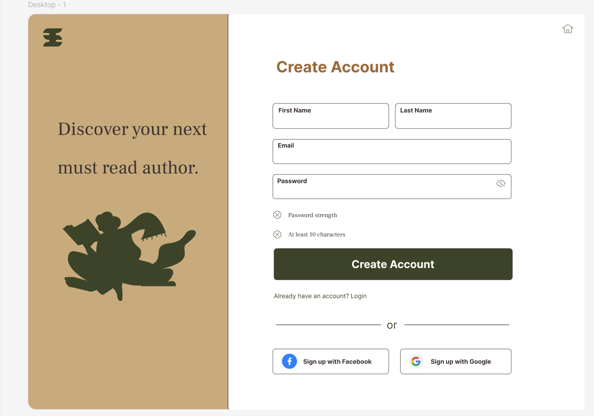

# BOOK-REVIEW-APP

create a 2 folder in src 1: pages 2: components

1 : pages
    1: create auth page give name to the file Auth.js
    2: if you are not using any library for css then crete a folder Auth and in the auth folder create 2 file aut.js and auth.css
    3:  
    4 : [figma url for design](https://www.figma.com/design/91yNz3rspT01Mwhem6WQlH/Book-Subscription-Login-Page-(Community)?node-id=0-1&p=f&t=hNiWWvsTjb0lNWnN-0)